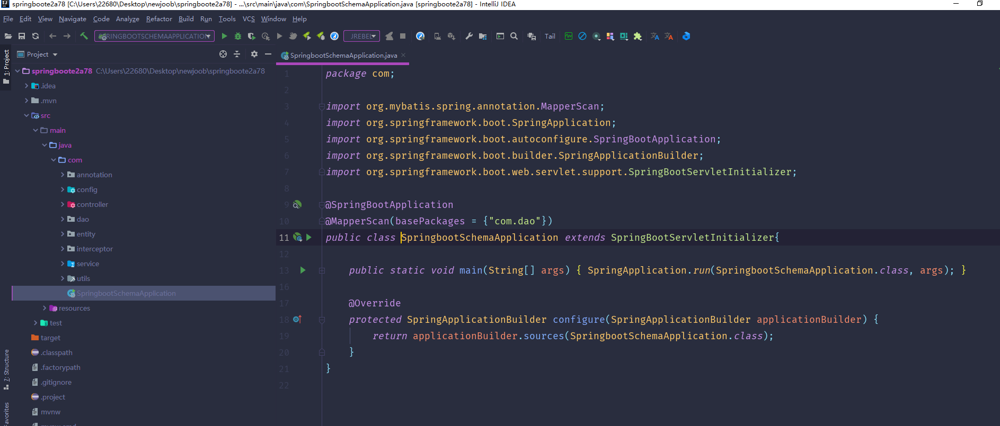
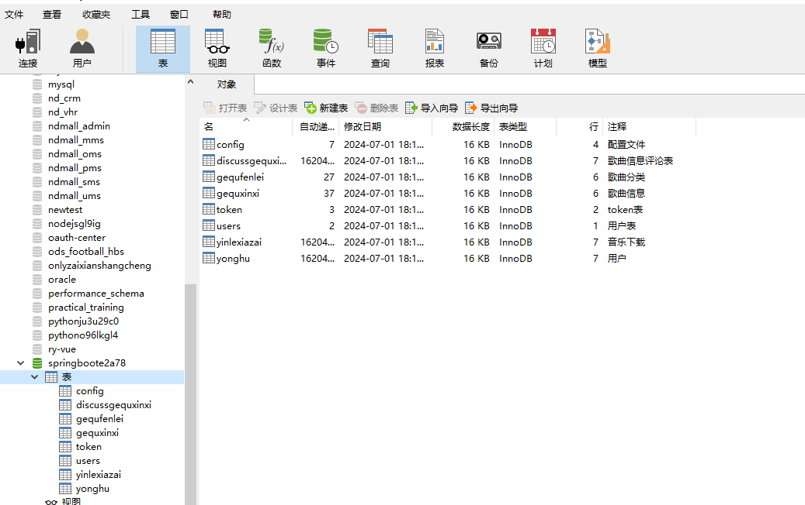
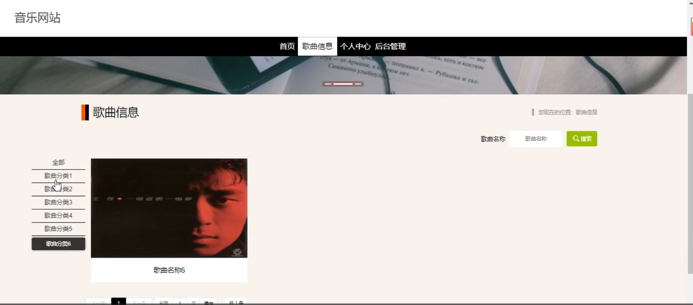
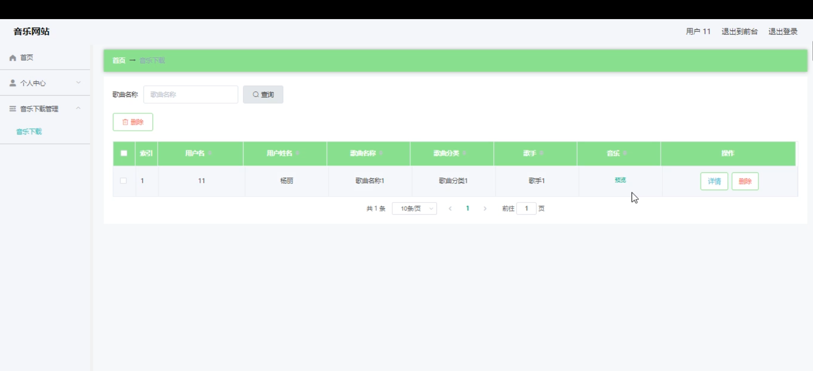
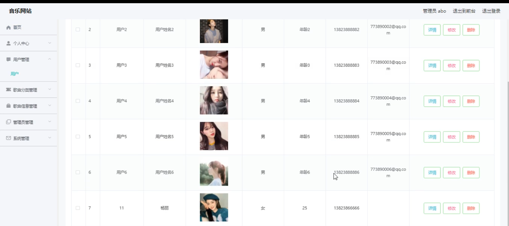
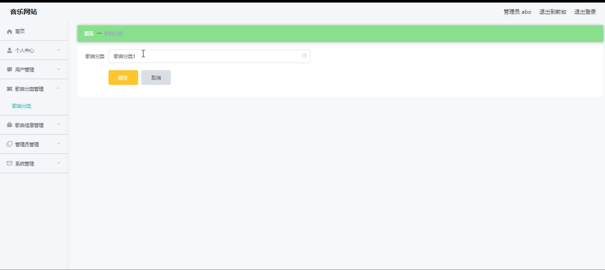
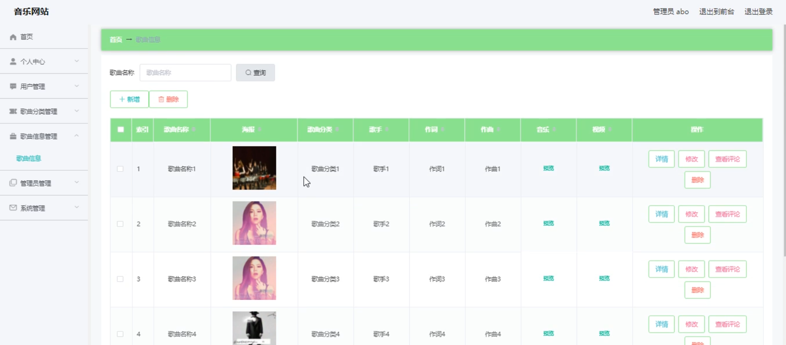
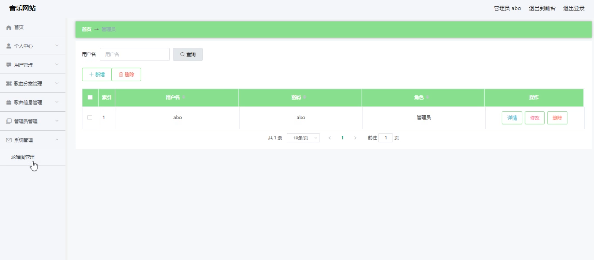
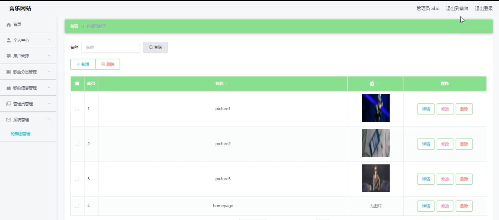

# 基于web的音乐网站

---
### 👉作者QQ ：1556708905 微信：zheng0123Long (支持定制修改、部署调试、定制毕设)

### 👉接网站建设、小程序、H5、APP、各种系统等

---

#### 介绍

基于Web的音乐网站旨在为音乐爱好者提供一个丰富、便捷的音乐体验平台。通过系统化的管理功能和用户友好的界面，用户可以轻松地浏览、下载和管理音乐，管理员可以高效地管理用户、歌曲和系统配置。系统分为管理员角色和用户角色，两者拥有不同的功能模块，以确保系统的安全性和高效性。

#### 技术栈

后端技术栈：Springboot+Mysql+Maven

前端技术栈：Vue+Html+Css+Javascript+ElementUI

开发工具：Idea+Vscode+Navicate

#### 系统功能介绍

（一）管理员角色  
个人中心：管理员可以在此查看和修改个人信息，包括登录密码、联系方式等。  
用户管理：对注册用户进行管理，如审核新用户注册申请、查看用户信息、处理用户违规行为等。  
歌曲分类管理：根据音乐的风格、语种、年代等属性对歌曲进行分类，方便用户查找和筛选。  
歌曲信息管理：负责歌曲的上传、编辑和删除，包括歌曲的名称、歌手、专辑、歌词等信息。  
管理员管理：若存在多个管理员，可进行管理员权限分配、工作安排等管理操作。  
系统管理：涵盖系统的维护、升级，服务器的监控，以及数据库的管理和优化等。  

（二）用户角色  
首页：展示热门歌曲、推荐歌单、最新音乐等，引导用户快速发现感兴趣的音乐。  
歌曲信息：用户能够查看歌曲的详细介绍，包括歌手简介、创作背景等。  
个人中心：用户可以修改个人资料，设置个性化的音乐偏好，查看自己的听歌历史和收藏歌曲。  
后台管理  
音乐下载管理：用户可以管理自己下载的音乐，如删除已下载的歌曲，重新下载等。  

#### 系统作用

丰富音乐资源获取渠道  
为用户提供了一个集中且丰富的音乐库，用户无需在多个平台搜索，节省时间和精力。  
不断更新和扩充歌曲资源，满足用户对不同类型音乐的需求。  
个性化音乐体验  
用户可以根据自己的喜好设置个人中心，系统根据用户的偏好推荐相关歌曲和歌单。  
有助于用户发现新的音乐和艺术家，拓展音乐视野。  
有效管理和运营  
管理员能够对歌曲和用户进行高效管理，确保网站的秩序和内容质量。  
系统管理功能保障了网站的稳定运行，提升用户访问的流畅性和安全性。  
促进音乐文化传播  
为音乐爱好者提供了一个交流和分享的平台，促进音乐文化的传播和发展。  
通过用户的互动和评价，推动优秀音乐作品的传播和认可。  

#### 系统功能截图

代码结构

数据库表

登录

前台页面首页

歌曲信息

用户端后台管理

管理员端用户管理

歌曲分类管理

歌曲信息管理

管理员管理

系统管理

#### 总结

本基于 Web 的音乐网站凭借其完善的功能模块和人性化的设计，为管理员和用户提供了优质的服务。对于管理员来说，能够实现对网站的有效管理和运营；对于用户而言，能够享受到便捷、个性化的音乐体验。未来，我们将不断优化和完善该音乐网站，紧跟音乐行业的发展趋势和用户需求的变化，为广大音乐爱好者打造更加出色的音乐平台。

#### 使用说明

创建数据库，执行数据库脚本 修改jdbc数据库连接参数 下载安装maven依赖jar 启动idea中的springboot项目

后台地址：http://localhost:8080/springboote2a78/admin/dist/index.html

管理员  abo 密码 abo

前台地址：http://localhost:8080/springboote2a78/front/index.html

